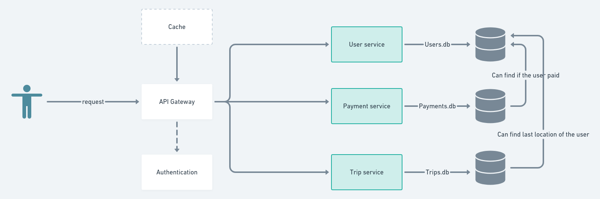

# lab-pad

This project was generated using [Nx](https://nx.dev).

<p style="text-align: center;"></p>

🔎 **Smart, Extensible Build Framework**

## _An Alternative for Yandex.Taxi_
#### FAF-182 Constantinova Carina, Postovan Teodora

### List of services
Main implemented services will be:
- Gateway
- User service
- Payment service
- Trip service
- Cache service

### API endpoints
GET /api/status - to check if service is alive

GET /api/user

POST /api/user

POST /api/status

POST /api/register-service - it will call an internal API from gateway service

GET /trip/location/get

POST /trip/location/push

POST /payment/register-intent

POST /payment/confirm

## A list of technologies to be used
We will use:
* Node.js using tool Nx that generates the application 
* MongoDB easy to use, no constraints, no tables 
* Docker 
* express() HttpServer


### System Architecture


# How to start

```
docker-compose up -d
```

To view logs of specific services use:
```
docker-compose logs <service_name> -f --tail 10
```

# How to test

In the root of the project you have a postman collection already preconfigured with local environment
