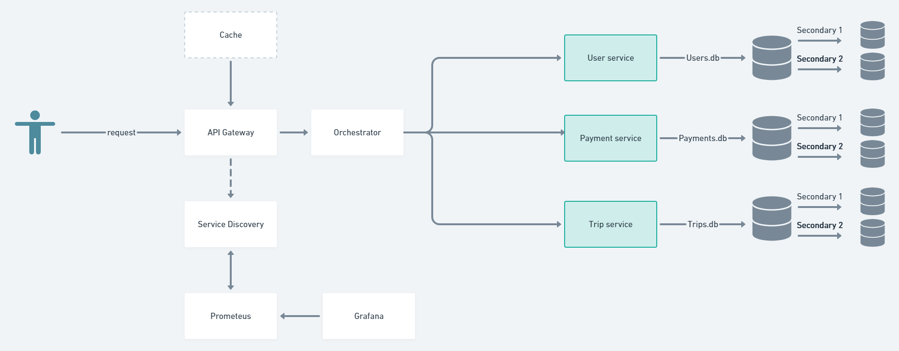

### Students: Constantinova Carina and Postovan Teodora

## Topic: An alternative for Yandex Taxi
### Checkpoint 1 in 2nd Laboratory Work
# Service
Service nodes are the ones that do the work a client is interested in. They receive tasks, process them and send back responses. Processing requests is usually costly so we imply the help of gateways and caches. Each service has a database.
- Long-running saga transactions;
- Database redundancy/replication + failover. Service instances connect to different DB replicas; 
- Prometheus + Grafana for logging 
# The Gateway
The gateway is the node that receives and forwards user tasks to the service nodes. Based on some logic, the gateway caches responses and balances the load of service nodes. Finally, it has a service registry and chooses from registered services when load balancing.
Features to be implemented:
- Service high availability (if a request to a service fails or the service is otherwise unavailable, route the request to a different one);
- Trip circuit breaker if multiple re-routes happen;
- Prometheus + Grafana for logging;

# Cache
A cache allows your system to temporary store responses given by your services and serve them without bothering the service nodes. Using caches makes your system more responsive. Usually caches use in-memory storage.
Features to be implemented:
-	Cache replication;
-	Distributed cache using consistency hashing;

## Languages to be used: Typescript, Javascript, Python;
Tools to be used:
-	Node.js using tool Nx that generates the application;
-	MongoDB easy to use, no constraints, no tables (for services);
-	Docker;

# Diagram

